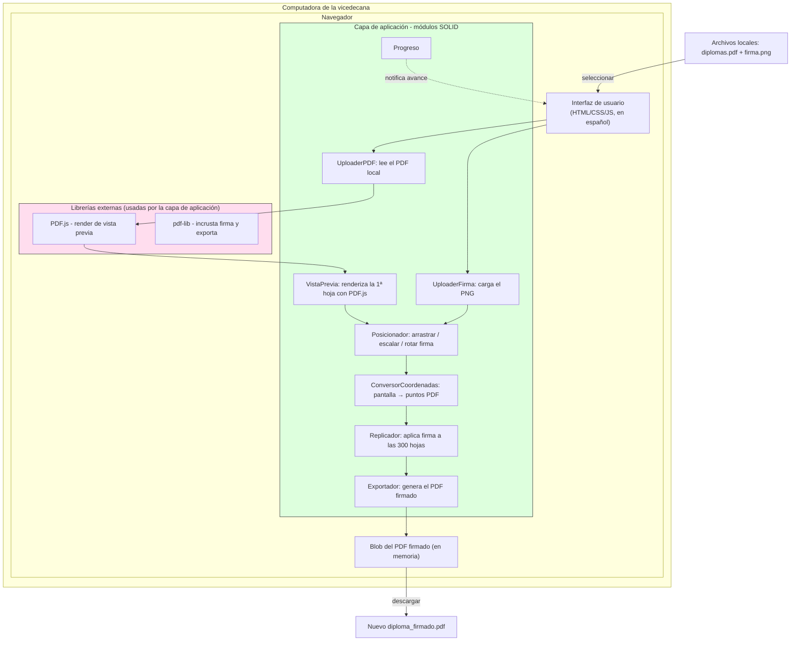

# Firmador de Diplomas en PDF

## 1. Resumen del proyecto

Aplicación web gratuita y de código abierto que permite firmar digitalmente diplomas en PDF con la imagen de firma de la vicedecana.

El caso de uso es el siguiente: el área de postgrado de la universidad genera un **único archivo PDF que contiene hasta 300 diplomas** (una hoja por alumno). Todas las hojas usan el **mismo diseño de diploma**; lo único que cambia entre ellas son los datos del alumno (nombre, título, fecha, etc.).

Por eso, la firma se ubica **una sola vez** sobre la primera hoja y el sistema la **replica automáticamente en la misma posición** sobre las 300 hojas restantes del PDF.

La herramienta está pensada para que la use la vicedecana (o personal del vicedecanato) desde el navegador de su computadora, sin instalar programas y sin conocimientos técnicos.

## 2. Problema que resuelve

- Hoy, colocar la firma en un PDF de 300 diplomas implica abrir cada PDF en un editor y posicionar la firma manualmente, una hoja a la vez (lento, repetitivo, propenso a errores).
- No existe en la universidad una herramienta simple, económica y segura para hacerlo.
- Alternativas comerciales resultan costosas, requieren instalación o envían los diplomas a servidores externos (riesgo para datos personales de alumnos).

## 3. Solución propuesta

### Flujo de uso (pensado para persona no técnica)

1. **Subir el PDF** con los diplomas (un solo archivo, de una o muchas páginas).
2. **Subir la imagen de firma** (archivo PNG con fondo transparente idealmente).
3. **Ubicar la firma una sola vez**: se muestra la primera hoja del PDF y la usuaria arrastra la firma con el ratón hasta la posición deseada. Puede ajustar tamaño (y opcionalmente rotarla).
4. **Aplicar a todo el documento**: el sistema copia la firma en la misma posición en todas las hojas del PDF.
5. **Descargar** el PDF firmado completo.

### Ejemplo de escala

| Concepto | Valor |
|---|---|
| Hojas por PDF | Hasta 300 diplomas |
| Posicionamientos manuales | 1 único |
| Hojas firmadas automáticamente | Las 300 |
| Tiempo estimado por documento | Menos de 1 minuto |

## 4. Arquitectura y tecnología

### Principio clave: 100% en el navegador

Todo el procesamiento ocurre en la computadora de la usuaria. **El PDF nunca sale de su equipo**: no hay servidor, no hay base de datos, no se sube nada a internet salvo la visita a la página web.

Esto da dos ventajas críticas:

- **Privacidad**: los diplomas con datos de alumnos permanecen en la PC de la vicedecana.
- **Costo: $0** en infraestructura (no hay que pagar servidores).

### Stack

| Componente | Tecnología | Función |
|---|---|---|
| Interfaz | HTML + CSS + JavaScript | Página única, en español, sin instalación |
| Lectura/visualización de PDF | **PDF.js** (Mozilla) | Renderiza la primera hoja en pantalla para posicionar la firma |
| Edición del PDF | **pdf-lib** | Incrusta la imagen de firma en cada página y exporta el archivo final |
| Alojamiento | Cloudflare Pages / GitHub Pages / Netlify | Web pública gratuita |

### Cómo se procesan las 300 hojas con buen rendimiento

- Solo se renderiza en pantalla **la primera página** para posicionar la firma (o unas pocas, si se desea ver otras). Cargar 300 hojas renderizadas sería lento e innecesario.
- La imagen de la firma se incrusta **una sola vez** dentro del archivo y se reutiliza por referencia en las 300 páginas. Esto mantiene el tamaño del PDF final razonable.
- El procesamiento de las 300 páginas en segundo plano tarda unos pocos segundos y se muestra una barra de progreso.
- El PDF original **no se re-renderiza**: se copia tal cual y solo se añade la firma, de modo que no se pierde calidad, texto ni formato.

### Diagrama de la arquitectura

Flujo real: los archivos se **abren, procesan y guardan** dentro del navegador. A internet solo llega la descarga de la página web y de las librerías; **el PDF nunca abandona el equipo**.

## 5. Diseño de código con principios SOLID

El código se organiza en **módulos pequeños y desacoplados** siguiendo los principios SOLID, de modo que el proyecto sea fácil de mantener, probar y ampliar. Cada módulo representa una responsabilidad y las librerías se inyectan como dependencias.

### Mapa de módulos

| Módulo | Responsabilidad |
|---|---|
| `UploaderPDF` | Lee y valida el archivo PDF seleccionado |
| `UploaderFirma` | Lee y valida la imagen de firma (PNG) |
| `VistaPrevia` | Renderiza la primera hoja con PDF.js para posicionar |
| `Posicionador` | Maneja el arrastre, escala y rotación de la firma |
| `ConversorCoordenadas` | Convierte posición de pantalla a puntos PDF |
| `Replicador` | Copia la firma en la misma posición en cada página |
| `Exportador` | Arma y descarga el PDF firmado |

### Aplicación de cada principio

| Principio | Cómo se cumple en el proyecto |
|---|---|
| **S – Single Responsibility** | Cada módulo tiene **una única razón de cambiar** (leer, posicionar, convertir, replicar, exportar). Ningún módulo mezcla UI con lógica de PDF. |
| **O – Open/Closed** | El sistema está **abierto a extensión y cerrado a modificación**: nuevas funciones (rotación, opacidad, firma en lote, paginador) se agregan como **nuevos módulos o configuraciones**, sin reescribir los existentes. |
| **L – Liskov Substitution** | Los módulos se usan a través de **contratos/operaciones genéricas**. Por ejemplo, cualquier implementación de "vista previa" o "exportador" (PDF.js, otro renderizador, etc.) puede sustituir a la actual sin romper el flujo. |
| **I – Interface Segregation** | Se prefieren **interfaces pequeñas y específicas**. Por ejemplo `Posicionador` solo sabe de arrastre/escala/rotación; no conoce ni PDF ni imágenes. `Replicador` solo aplica la firma; no dibuja la UI. |
| **D – Dependency Inversion** | Los módulos dependen de **abstracciones, no de librerías concretas**. PDF.js y pdf-lib se inyectan por dependencia (constructor/parámetro), de modo que si mañana se usa otra librería, solo cambia la inyección, no la lógica de negocio. |

### Ventaja práctica

El principio **D** es el más valioso aquí: si pdf-lib o PDF.js cambian, la aplicación o los módulos que dependen de ellas se aíslan detrás de sus propios contratos, y **el flujo de "subir → ubicar → replicar → descargar" queda intacto**. Además, al separar módulos, cada parte se puede **probar por separado** (tests unitarios sin abrir el navegador).

## 6. Alcance del proyecto

### MVP (versión inicial, prioridad máxima)

- Subir PDF (múltiples páginas) y PNG de firma.
- Vista previa de la primera hoja.
- Arrastrar, redimensionar y rotar la firma sobre la hoja.
- Replicar la firma en la misma posición sobre todas las páginas.
- Descargar el PDF firmado.
- Indicador de progreso durante la exportación.

### Mejoras futuras (posibles)

- Recordar la firma y su posición en el navegador (si vuelve a abrir la web, ya aparece lista la firma con su posición).
- Vista previa de cualquier página del PDF (paginador) para verificar la posición antes de exportar.
- Ajustar opacidad de la firma.
- Firmar varios PDFs en lote (subir varios archivos y procesarlos de una vez).
- Revisión/control de calidad: comparar visualmente una hoja original y una firmada.

## 7. Riesgos y mitigaciones

| Riesgo | Mitigación |
|---|---|
| Firma se ve borrosa en el PDF final (diplomas suelen verse a 300 dpi) | Incrustar la imagen de la firma a resolución alta (triple de tamaño) y con buena compresión |
| PDFs escaneados o generados por software poco común que PDF.js no abre | Probar con muestras reales de la universidad; si falla, mostrar un mensaje claro en lugar de bloquearse |
| Posición desplazada entre la vista y el PDF final | Convertir correctamente las coordenadas de pantalla a puntos PDF; verificar con diplomas tamaño carta/A4 |
| Archivo final demasiado grande con 300 firmas | Reutilizar una única imagen incrustada (referencia, no copias) |
| Caída de los servidores CDN de las librerías | Alojar también las librerías dentro del propio servidor web |

## 8. Plan de trabajo (estimaciones)

| Fase | Duración estimada | Entregable |
|---|---|---|
| 1. Base de la página | 1 día | Subida de PDF y PNG, interfaz en español |
| 2. Vista previa | 1-2 días | Render de la primera hoja con PDF.js, zoom y ajuste de pantalla |
| 3. Posicionamiento | 1-2 días | Arrastrar / redimensionar / rotar la firma y guardar su posición |
| 4. Replicado y descarga | 1-2 días | Aplicar firma a las 300 páginas con pdf-lib, barra de progreso y descarga |
| 5. Pruebas con casos reales | 1 día | Probar con diplomas reales del área de postgrado y corregir detalles |

Tiempo total estimado del MVP: **aprox. 1 semana**.

## 9. Validaciones importantes antes de cerrar

- Confirmar el **tamaño de hoja** real de los diplomas (carta, A4, orientación vertical/horizontal).
- Confirmar que la firma recibida es **PNG con transparencia** (o convertirla sin fondo).
- Confirmar el **tamaño máximo** típico de los PDFs (peso en MB) para asegurar que se abren rápido en el navegador.
- Probar el posicionamiento con **muestras reales** (2 o 3 diplomas) antes de usarla en producción.

## 10. Despliegue y publicación

La aplicación está publicada en **GitHub Pages** (alojamiento gratuito y permanente).

| Dato | Valor |
|---|---|
| URL de acceso | **https://kurterodrigo.github.io/pdf-firmador-diplomas/** |
| Repositorio | https://github.com/KurteRodrigo/pdf-firmador-diplomas (público) |
| Rama de despliegue | `main` (raíz del proyecto) |
| Actualización | Automática: cada push a `main` regenera el sitio en ~1 minuto |

**Notas:**
- El repositorio es **público** a propósito: en el plan gratuito de GitHub, Pages solo está disponible para repositorios públicos. No representa riesgo, ya que el código no contiene secretos ni datos, y los diplomas se procesan íntegramente en el navegador sin salir del equipo.
- Para ejecutar en local durante el desarrollo: `python3 -m http.server 8000` y abrir `http://localhost:8000` (los módulos JS requieren un servidor, no funcionan con doble clic sobre `index.html`).